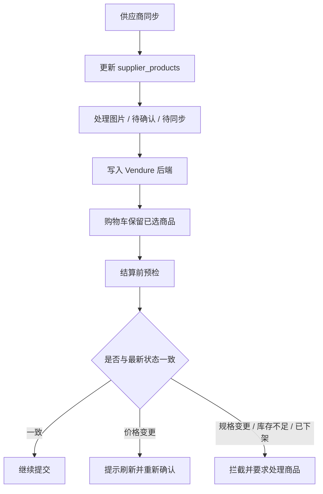

# 商品采集与发布 SOP

这份文档给当前后台一份统一口径，专门说明：

- 商品正式同步怎么做
- 分类、商品、图片采集怎么做
- 图片怎么处理
- 当前哪些动作可以在 UI 里做
- 当前哪些动作不要再做

适用入口：

- `/_/mrtang-admin`
- `/_/mrtang-admin/target-sync`
- `/_/mrtang-admin/source`
- `/_/mrtang-admin/source/products`
- `/_/mrtang-admin/source/assets`
- `/_/mrtang-admin/backend-release`

## 一、先记住当前原则

当前有两条相关链路，但只有一条是正式主链：

1. `供应商同步`
   - 正式主链
   - 负责价格、规格、库存、上下架
   - 直接更新 `supplier_products`
   - 会处理缺失商品下架

2. `target-sync -> source`
   - 辅助审核链
   - 负责分类来源核对、图片采集、图片处理、商品审核
   - 不再作为供应商正式规格同步入口
   - 当前 UI 也不再提供从 source 直接发布商品的按钮，避免覆盖正式同步结果

一句话：

- 商品正式同步，看 `供应商同步`
- 图片和审核，看 `target-sync / source`

### 流程简图

这个流程的关键点是：

- 购物车只保存用户意向，不当作最终锁定
- 价格、规格、库存、上下架都以结算前最新校验结果为准
- 同步后如果用户已经把商品放进购物车，通常还能继续进结算页，但不能绕过预检

## 二、页面分工

### 1. `/_/mrtang-admin`

总览页，主要看：

- 最近一次供应商同步
- source 商品/图片概览
- 快捷入口

### 2. `/_/mrtang-admin/target-sync`

抓取入库页，当前主要用于：

- 抓分类树
- 刷新分类商品来源
- 全量重建分类商品归属
- 按已保存商品抓图片
- 查看当前运行、最近运行、图片与分类差异

当前这里不再提供“抓商品规格到审核区”的 UI 按钮。

### 3. `/_/mrtang-admin/source/products`

商品审核页，当前主要用于：

- 查看 `source_products`
- 处理 `imported`
- 批量通过 / 批量拒绝
- 查看 bridge 历史状态

当前这里不再提供 source 商品发布按钮。

### 4. `/_/mrtang-admin/source/assets`

图片处理页，当前主要用于：

- 下载原图
- 处理待处理图片
- 重处理失败图片
- 查看原图失败 / 处理失败原因

### 5. `/_/mrtang-admin/backend-release`

发布准备页，当前主要用于：

- 看 Vendure 字段准备度
- 看分类映射
- 小批量联调 backend 发布准备项

## 三、正式商品同步流程

这条流程对应价格、规格、库存、上下架。

### 适用场景

- 供应商改价
- 供应商规格变更
- 供应商库存变化
- 供应商下架商品
- 需要让小程序下单预检基于最新供应商数据

### 操作步骤

1. 打开 `/_/mrtang-admin` 或 `/_/mrtang-admin/target-sync`
2. 找到“供应商同步”卡片
3. 点击 `立即供应商同步`
4. 等待运行记录进入 `success / partial / failed`
5. 如有失败，点“供应商同步详情”查看失败项
6. 同步完成后，再检查：
   - 商品价格是否更新
   - 商品规格是否更新
   - 缺失商品是否被标记为 `offline`
   - backend/Vendure 禁用是否正常

### 这一步会做什么

- 从真实供应商抓当前商品结果
- 更新 `supplier_products`
- 对缺失商品执行离线对账
- 尝试禁用已不存在的 backend 商品

### 这一步不会做什么

- 不会经过 `source_products` 人工审核
- 不会使用 `target-sync` 的图片处理结果作为正式主链输入

## 四、分类与图片采集流程

这条流程对应 source 审核区，不是正式商品同步主链。

### 适用场景

- 核对分类树
- 核对分类下商品归属
- 抓取最新封面、轮播、详情图
- 为图片处理准备素材

### 推荐顺序

1. 进入 `/_/mrtang-admin/target-sync`
2. 点击 `抓分类树`
3. 点击 `刷新分类商品来源`
4. 如发现分类归属不一致，再执行 `全量重建分类商品归属`
5. 点击 `按已保存商品抓图片`
6. 等图片抓取完成后，进入 `/_/mrtang-admin/source/assets`

### 每一步的含义

#### `抓分类树`

- 更新 `source_categories`
- 让后台知道当前分类层级和路径

#### `刷新分类商品来源`

- 更新分类到商品的来源关系
- 用于后续图片抓取和分类核对

#### `全量重建分类商品归属`

- 基于已保存来源重建归属
- 不直接请求源站
- 更适合归属异常后的修复

#### `按已保存商品抓图片`

- 将封面、轮播、详情图写入 `source_assets`
- 图片抓取会优先复用已落库商品结果

## 五、商品审核流程

当前商品审核是“看 source，不直接从 source 发布”。

### 入口

- `/_/mrtang-admin/source/products`

### 推荐操作

1. 筛选 `productStatus=imported`
2. 检查：
   - 标题
   - 分类
   - 默认单位
   - 多单位数量
   - 价格显示
   - 缩略图是否正确
3. 没问题后执行：
   - 单条 `通过`
   - 或批量 `按当前筛选结果批量通过`
4. 不合适的商品执行拒绝

### 当前状态含义

- `imported`
  - 待审核
- `approved`
  - 已审核
- `promoted`
  - 历史已发布链处理
- `rejected`
  - 已拒绝

### 当前特别说明

当前 UI 已移除 source 商品发布动作。

原因是：

- 正式供应商同步现在走 `供应商同步`
- 如果继续从 source 把商品写回 `supplier_products`
- 容易覆盖最新的供应商价格、规格、上下架结果

所以现在 `source/products` 的定位是：

- 审核区
- 对照区
- 历史 bridge 状态查看区

不是正式商品发布入口。

## 六、图片处理流程

### 入口

- `/_/mrtang-admin/source/assets`
- `/_/mrtang-admin/source/asset-jobs`

### 推荐顺序

1. 先看 `assetStatus=pending`
2. 如果要保留源图，再先执行原图下载
3. 对待处理图片执行批量处理
4. 对失败图片执行批量重处理
5. 打开单图详情检查处理结果

### 列表页常用动作

- `批量下载待下载原图`
- `按当前筛选结果下载原图`
- `仅对选中图片下载原图`
- `批量处理待处理图片`
- `批量重处理失败图片`
- 单图 `下载原图`
- 单图 `处理`

### 关键状态

`source_assets.original_image_status`

- `pending`
- `downloading`
- `downloaded`
- `failed`

`source_assets.image_processing_status`

- `pending`
- `processing`
- `processed`
- `failed`

### 图片变更回写

当抓取入库发现图片这些字段变化时，图片会自动回到 `pending`：

- 图片地址
- 图片角色
- 排序

并清空旧处理结果：

- `processed_image`
- `processed_image_source`
- `image_processing_error`

这意味着：

- 图片一旦变更，必须重新处理
- 旧处理结果不能直接沿用

## 七、当前“发布商品（包括图片）”应怎样理解

当前 UI 下，商品与图片的“发布”要拆开理解。

### 1. 商品正式发布

当前正式主链是：

1. `供应商同步`
2. `supplier_products`
3. backend / Vendure 同步链

也就是说，商品正式价格、规格、上下架，以 `supplier_products` 为准。

### 2. 图片采集与处理

当前图片链是：

1. `target-sync`
2. `source_assets`
3. 下载原图 / 处理图片 / 重处理失败图片

这部分当前主要用于：

- 审核
- 素材准备
- 后续受控发布准备

### 3. 当前限制

当前 UI 已去掉从 `source/products` 直接把商品重新发布到 `supplier_products` 的入口。

因此：

- 图片处理结果不会由运营在 source 页直接“顺手发布商品”
- 正式商品同步仍应走 `供应商同步`
- 如果后续需要重新开放“受控发布 source 结果”，必须先明确不会覆盖正式供应商主链

## 八、日常建议操作模板

### 场景 A：供应商改价 / 改规格 / 下架

1. 先跑 `供应商同步`
2. 看运行记录是否成功
3. 如有异常，打开“供应商同步详情”
4. 再去小程序或 backend 抽查

### 场景 B：要核对分类和图片

1. 打开 `target-sync`
2. 抓分类树
3. 刷新分类商品来源
4. 按已保存商品抓图片
5. 到 `source/assets` 处理图片

### 场景 C：要人工检查 source 商品

1. 打开 `source/products`
2. 筛 `imported`
3. 检查商品信息
4. 通过或拒绝
5. 不在这里做正式商品发布

## 九、常见误区

### 误区 1

“抓取入库”就是正式商品同步。

不是。

当前正式商品同步主链是 `供应商同步`，不是 `target-sync`。

### 误区 2

`source/products` 审核通过后，应该继续从这里发布。

不是当前推荐方式。

当前 UI 已移除这类按钮，就是为了避免覆盖正式供应商同步结果。

### 误区 3

图片处理完成就等于商品已经正式挂图上线。

不是。

当前图片处理主要是审核与素材准备链路，和正式商品主链要分开看。

## 十、文档索引

- 抓取入库模块： [target-sync.md](./target-sync.md)
- source 审核模块： [source-review-workbench.md](./source-review-workbench.md)
- 后台模块总览： [mrtang-admin.md](./mrtang-admin.md)
- backend 字段映射： [backend-release-contract.md](./backend-release-contract.md)
