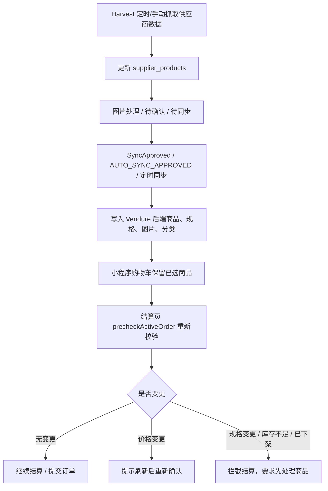

# mrtang-pim 启动说明

`mrtang-pim` 当前已经不是概念方案，而是一套可运行的 `Golang + PocketBase` PIM 服务。它负责承接供应商商品、图片处理、人工审核、Vendure 同步，以及小程序首页数据接入。

## 当前架构

项目分成两条主链路：

1. PIM 商品链路
   `Supplier -> PocketBase -> Image Processor -> Admin Review -> Vendure`
2. Miniapp 契约链路
   `Snapshot/Raw Source -> miniapp importer/service -> API -> 后续入库`

当前目录重点如下：

```text
mrtang-pim/
├── cmd/pim/main.go
├── datasets/
│   ├── miniapp/
│   │   ├── category-page/
│   │   │   ├── context.json
│   │   │   ├── contracts.json
│   │   │   ├── meta.json
│   │   │   ├── tree.json
│   │   │   └── sections/
│   │   ├── product-page/
│   │   │   ├── contracts.json
│   │   │   ├── meta.json
│   │   │   └── products/
│   │   ├── cart-order/
│   │   │   ├── cart.json
│   │   │   ├── contracts.json
│   │   │   ├── meta.json
│   │   │   └── order.json
│   │   └── homepage/
│   │       ├── bootstrap.json
│   │       ├── category-tabs.json
│   │       ├── contracts.json
│   │       ├── meta.json
│   │       ├── settings.json
│   │       ├── template.json
│   │       └── sections/
│   └── mock_supplier_products.json
├── docs/
│   ├── rr/
│   ├── rr.md
│   └── start.md
├── internal/
│   ├── config/
│   ├── image/
│   ├── miniapp/
│   │   ├── api/
│   │   ├── importer/
│   │   ├── model/
│   │   ├── repository/
│   │   └── service/
│   ├── pim/
│   ├── supplier/
│   └── vendure/
└── migrations/
```

## PIM 商品流程

当前运营侧建议按两条链理解：

1. `供应商同步`
   - 正式主链
   - 从真实供应商拉取价格、规格、库存、上下架
   - 直接更新 `supplier_products`
   - 对缺失商品执行 `offline`
2. `抓取入库 -> source 审核/图片处理`
   - 辅助审核链
   - 负责分类来源核对、图片采集、商品审核、图片处理
   - 不再作为正式商品发布主链

当前最常用状态：

- `source_products.review_status`
  - `imported -> approved`
  - `promoted` 仅表示历史已发布链处理
- `supplier_products.sync_status`
  - `approved / ready / synced / offline / error`

### 流程简图



这张图对应的核心原则是：

- `Harvest` 负责同步供应商真实数据
- `Sync` 负责把已批准商品写入后端
- `Checkout` 负责在提交前再校验一次最新状态
- 购物车不是最终锁定态，真正以结算前预检为准

## Miniapp 首页流程

Miniapp 模块已经拆成明确分层：

- `internal/miniapp/api`
  数据源层。支持 `snapshot` 和 `raw` 两种 source。
- `internal/miniapp/importer`
  把上游 `Dataset` 整理成标准首页模型。
- `internal/miniapp/model`
  首页领域模型和契约模型。
- `internal/miniapp/repository`
  预留入库接口，后续用于保存首页数据。
- `internal/miniapp/service`
  编排 `load -> transform -> expose`。

当前支持两种数据源模式：

- `MINIAPP_SOURCE_MODE=snapshot`
  从 `MINIAPP_HOMEPAGE_SNAPSHOT` 读取本地脱敏快照。
- `MINIAPP_SOURCE_MODE=raw`
  直接请求目标站原始 API，并在本项目内部标准化成 `Dataset`。

当使用 `raw` source 时，会自动带上：

- `Authorization: Bearer <MINIAPP_AUTH_ACCOUNT_ID>`
- `User-Agent: <MINIAPP_USER_AGENT>`

默认 `User-Agent` 是较新的 iPhone 微信小程序模板。

如果要快速理解“源站 API、抓包归档、dataset 和本地接口”之间的关系，直接看 [source-api.md](./source-api.md)。
如果要直接看 `mrtang-backend` shop API 经 `mrtang-pim` 代理后的分类树、分类商品和商品详情接口，也看 [source-api.md](./source-api.md) 里的 `Miniapp UI 代理链路`。
如果要直接对接结算页，优先看 [checkout-api.md](./checkout-api.md)。
如果要直接看商品采集、图片处理、正式供应商同步和当前操作 SOP，见 [product-capture-release-sop.md](./product-capture-release-sop.md)。
如果要直接看源站抓取入库模块、运行记录和变更详情，见 [target-sync.md](./target-sync.md)。
如果要直接看 source 商品审核与图片处理工作台，见 [source-review-workbench.md](./source-review-workbench.md)。
如果要理解后台模块结构和页面入口，见 [mrtang-admin.md](./mrtang-admin.md)。
如果要先规划 backend 与小程序发布前的能力缺口，再决定何时正式同步，见 [backend-miniapp-plan.md](./backend-miniapp-plan.md)。
如果要开始推进“小程序 UI 目标模型”，并按批次梳理分类页、商品页、多单位、B/C 图和结算规则，见 [miniapp-ui-plan.md](./miniapp-ui-plan.md)。
如果要直接看 source、supplier 与 Vendure 的字段映射和分类发布模型，见 [backend-release-contract.md](./backend-release-contract.md)。
如果要直接配置 Vendure custom fields，见 [vendure-field-setup.md](./vendure-field-setup.md)。

## 环境变量

至少关注这些配置：

- `PIM_HTTP_ADDR=127.0.0.1:26228`
- `PIM_DATA_DIR=./pb_data`
- `PIM_PUBLIC_URL`
- `PIM_API_KEY`
- `PIM_SUPERUSER_EMAIL`
- `PIM_SUPERUSER_PASSWORD`
- `MINIAPP_SOURCE_MODE`
- `MINIAPP_SOURCE_URL`
- `MINIAPP_SOURCE_TIMEOUT`
- `MINIAPP_RAW_TEMPLATE_ID`
- `MINIAPP_RAW_REFERER`
- `MINIAPP_HOMEPAGE_SNAPSHOT=./datasets/miniapp/homepage`
- `MINIAPP_CATEGORY_SNAPSHOT=./datasets/miniapp/category-page`
- `MINIAPP_PRODUCT_SNAPSHOT=./datasets/miniapp/product-page`
- `MINIAPP_CART_ORDER_SNAPSHOT=./datasets/miniapp/cart-order`
- `MINIAPP_AUTH_ACCOUNT_ID`
- `MINIAPP_USER_AGENT`
- `SUPPLIER_CONNECTOR=file`
- `SUPPLIER_FILE=./datasets/mock_supplier_products.json`
- `SUPPLIER_HTTP_BASE_URL`
- `SUPPLIER_HTTP_SUBMIT_PATH=/purchase-orders`
- `SUPPLIER_HTTP_TOKEN`
- `SUPPLIER_HTTP_API_KEY`
- `IMAGE_PROCESSOR=mock|webhook`
- `VENDURE_ADMIN_API`
- `VENDURE_ADMIN_TOKEN`
- `VENDURE_SHOP_API`
- `VENDURE_CF_VARIANT_SUPPLIER_CODE`
- `VENDURE_CF_VARIANT_SUPPLIER_COST_PRICE`
- `VENDURE_CF_VARIANT_CONVERSION_RATE`
- `VENDURE_CF_VARIANT_SOURCE_PRODUCT_ID`
- `VENDURE_CF_VARIANT_SOURCE_TYPE`
- `VENDURE_CF_PRODUCT_TARGET_AUDIENCE`
- `VENDURE_CF_PRODUCT_C_END_FEATURED_ASSET`

完整示例见项目根目录 `.env.example`。

## 启动方式

```bash
cd mrtang-pim
cp .env.example .env
go mod tidy
go run ./cmd/pim serve
```

默认地址：

- Admin UI: `http://127.0.0.1:26228/_/`
- Mrtang Admin: `http://127.0.0.1:26228/_/mrtang-admin`
- 抓取入库: `http://127.0.0.1:26228/_/mrtang-admin/target-sync`
- Source Home: `http://127.0.0.1:26228/_/mrtang-admin/source`
- Backend Release: `http://127.0.0.1:26228/_/mrtang-admin/backend-release`
- Source Products: `http://127.0.0.1:26228/_/mrtang-admin/source/products`
- Source Assets: `http://127.0.0.1:26228/_/mrtang-admin/source/assets`
- Source Logs: `http://127.0.0.1:26228/_/mrtang-admin/source/logs`
- Procurement: `http://127.0.0.1:26228/_/mrtang-admin/procurement`
- Source Review Workbench: `http://127.0.0.1:26228/_/source-review-workbench`（兼容保留，建议改用 `/_/mrtang-admin/source/products`）
- Procurement Workbench: `http://127.0.0.1:26228/_/procurement-workbench`（兼容保留，建议改用 `/_/mrtang-admin/procurement`）
- Health: `http://127.0.0.1:26228/api/pim/healthz`

生产环境访问策略：

- 默认仅允许 PocketBase 超级管理员登录后访问 `/_/mrtang-admin/*`
- 默认关闭 localhost 绕过（`ADMIN_ALLOW_LOOPBACK_BYPASS=false`）
- 本地开发可保留绕过（`ADMIN_ALLOW_LOOPBACK_BYPASS=true`）

## 当前推荐操作

完整操作说明见 [product-capture-release-sop.md](./product-capture-release-sop.md)。

推荐操作顺序：

1. 先执行 `供应商同步`，对齐正式商品价格、规格、库存和上下架。
2. 再在 `/_/mrtang-admin/target-sync` 执行分类来源和图片抓取入库。
3. 再进入 `/_/mrtang-admin/source/products` 和 `/_/mrtang-admin/source/assets` 处理待审核商品与待处理图片。
4. 当前 `source` 页面只承担审核和图片处理，不再作为正式商品发布入口。

商品审核状态：

- `imported -> approved`
- `promoted` 表示历史已发布链处理
- 允许人工转为 `rejected`

图片处理状态：

- `pending -> processing -> processed`
- `failed` 可重试并重新进入处理链

## 当前可用接口

PIM：

- `POST /api/pim/harvest`
- `POST /api/pim/process`
- `POST /api/pim/sync`
- `GET /api/pim/procurement/capabilities`
- `GET /api/pim/procurement/workbench-summary`
- `POST /api/pim/procurement/summary`
- `POST /api/pim/procurement/export`
- `POST /api/pim/procurement/submit`
- `POST /api/pim/procurement/orders`
- `GET /api/pim/procurement/orders`
- `GET /api/pim/procurement/order?id=<id>`
- `POST /api/pim/procurement/order/review?id=<id>`
- `POST /api/pim/procurement/order/export?id=<id>`
- `POST /api/pim/procurement/order/status?id=<id>`

Miniapp：

- `GET /api/miniapp/contracts/homepage`
- `GET /api/miniapp/contracts/category-page`
- `GET /api/miniapp/homepage`
- `GET /api/miniapp/homepage/bootstrap`
- `GET /api/miniapp/homepage/settings`
- `GET /api/miniapp/homepage/template`
- `GET /api/miniapp/homepage/categories`
- `GET /api/miniapp/homepage/sections`
- `GET /api/miniapp/homepage/section?id=<section-id>`
- `GET /api/miniapp/category-page`
- `GET /api/miniapp/category-page/context`
- `GET /api/miniapp/category-page/tree`
- `GET /api/miniapp/category-page/sections`
- `GET /api/miniapp/category-page/section?id=<section-id>`
- `GET /api/miniapp/contracts/product-page`
- `GET /api/miniapp/contracts/cart-order`
- `GET /api/miniapp/product-page`
- `GET /api/miniapp/product-page/product?id=<spuId>_<skuId>`
- `GET /api/miniapp/product-page/detail?id=<spuId>_<skuId>`
- `GET /api/miniapp/product-page/pricing?id=<spuId>_<skuId>`
- `GET /api/miniapp/product-page/package?id=<spuId>_<skuId>`
- `GET /api/miniapp/product-page/context?id=<spuId>_<skuId>`
- `GET /api/miniapp/product-page/coverage`
- `GET /api/miniapp/product-page/coverage-summary`
- `GET /api/miniapp/cart-order`
- `GET /api/miniapp/cart-order/cart`
- `GET /api/miniapp/cart-order/order`
- `POST /api/miniapp/cart-order/cart/add`
- `POST /api/miniapp/cart-order/cart/change-num`
- `GET /api/miniapp/cart-order/cart/list`
- `GET /api/miniapp/cart-order/cart/list-summary`
- `GET /api/miniapp/cart-order/cart/detail`
- `GET /api/miniapp/cart-order/cart/detail-summary`
- `POST /api/miniapp/cart-order/cart/settle`
- `GET /api/miniapp/cart-order/order/default-delivery`
- `GET /api/miniapp/cart-order/order/default-delivery-summary`
- `GET /api/miniapp/cart-order/order/deliveries`
- `GET /api/miniapp/cart-order/order/deliveries-summary`
- `POST /api/miniapp/cart-order/order/address/analyse`
- `POST /api/miniapp/cart-order/order/address/add`
- `GET /api/miniapp/cart-order/order/freight-cost?scenario=preview|selected_delivery`
- `GET /api/miniapp/cart-order/order/freight-summary`
- `GET /api/miniapp-ui/collections/tree`
- `GET /api/miniapp-ui/collections/products?slug=<collection-slug>&audience=B|C&skip=0&take=24`
- `GET /api/miniapp-ui/products/detail?slug=<product-slug>&audience=B|C`
- `POST /api/miniapp/cart-order/order/submit`
- `GET /api/miniapp/cart-order/order/submit-summary`
- `GET /api/miniapp/cart-order/checkout-summary`

## 下一步

当前还缺两块正式能力：

1. `internal/miniapp/repository` 的真实入库实现
2. 真实上游 miniapp source 返回结果到本地数据库的同步任务

## 说明：cart-order 与采购自动下单是两条链路

- `cart-order`（小程序购物车到提交订单）已经实现，接口与样本见：
  - `docs/source-api.md` 中 `购物车与下单链路`
  - `docs/rr/cart-order/README.md`
- 但 `mrtang-ui` 线上真实下单主链路是：`mrtang-ui -> mrtang-backend shop-api(GraphQL)`。
- 履约链路是：`backend 订单 -> (可选) PIM 采购单 -> (可选) 供应商下单`。
- 其中第二段是否执行由开关决定：全局开关 + 用户开关。
- 排查顺序建议：
  1. 先确认 `mrtang-ui -> backend` 下单成功（订单已生成）。
  2. 再确认 backend 订单是否生成 `pimProcurementOrderId`。
  3. 然后确认 PIM 采购单状态与 `results_json`。
  4. 最后确认供应商侧是否落单（按 `externalRef=backend order code` 对账）。

